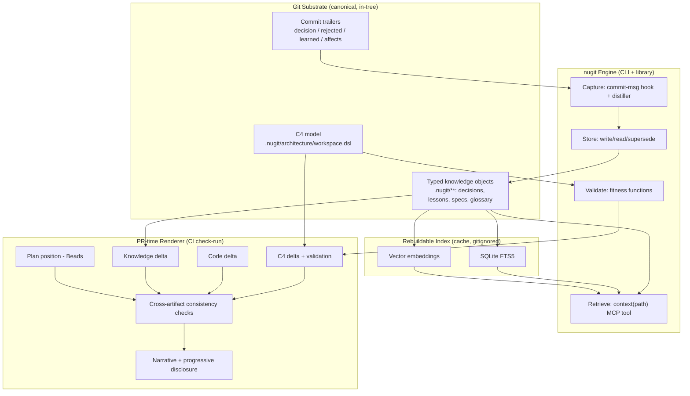

# nugit — Git-Native Typed Knowledge & Unified PR View

> **Architecture & Implementation Plan (handoff spec)**
> Status: Draft v1 · Target executor: autonomous coding agent · Name: `nugit` — a git-native nugget store for code knowledge.

---

## 0. How to read this document

This is a build spec for an autonomous coding agent. It is self-contained: you do not need any prior conversation to execute it. Work the **Implementation Plan (§11)** epic by epic in dependency order. Each epic has explicit tasks and acceptance criteria; do not advance to an epic until its dependencies' acceptance criteria pass. Where a decision is left open, see **§13 Open Decisions** and surface it rather than guessing.

The design rests on a small number of load-bearing principles (§2). If a task seems to conflict with a principle, the principle wins — raise it.

---

## 1. Overview

### 1.1 Problem

AI coding agents forget across sessions, re-derive architecture, repeat rejected approaches, and produce changes whose *why* is never captured. Existing fixes are fragmented: vector memory (mem0), commit-message conventions (Lore/ACC), spec frameworks (Spec Kit), decision records (ADRs), and architecture models (C4) each solve one slice and don't compose. Meanwhile the natural place where all of this should surface — the pull request — only ever shows a code diff, forcing every reviewer (human or agent) to reconstruct intent, architectural impact, and project trajectory from scratch.

### 1.2 What nugit is

nugit is a **typed knowledge layer stored in git**, plus a **PR-time renderer** that projects that knowledge into a single reviewable narrative. It unifies five knowledge types (lessons, decisions, the C4 architecture model, specs, glossary) under one git-native substrate with conflict-free concurrent writes, scoped/typed retrieval, and executable validation — then renders, at each PR, four synchronized deltas (architecture, code, knowledge, plan-position) with cross-artifact consistency checks and the full *why*.

### 1.3 One-line pitch

> Every PR shows how the architecture is changing, what the code is changing, what the project's knowledge is changing, where this sits in the plan, and why — computed from typed artifacts that live in the same git history as the code.

### 1.4 Goals

- Knowledge that is **versioned with code**, reviewed like code, and **atomic** with the change it describes.
- **Conflict-free** concurrent writes at monorepo/team scale.
- **Lean, scoped retrieval** — agents fetch only the typed knowledge relevant to the path/task, never the whole store.
- **Executable validation** — the intended architecture is enforced against the real code, not just documented.
- A **unified PR view** that turns review from archaeology into reading, and that *verifies* cross-artifact consistency rather than just presenting it.

### 1.5 Non-goals

- **No git fork.** Everything uses documented extension points (refs, hooks, `.gitattributes` merge drivers, sparse-checkout, worktrees). A patched git binary is explicitly out of scope.
- **No external DB as source of truth.** A database may exist only as a *rebuildable index/cache*; canonical state is git text. This preserves "what did the agent know at commit X" for free.
- Not a new VCS. nugit renders over git; it does not replace it.
- Not a model-training project. No fine-tuning in scope.

---

## 2. Core principles (load-bearing)

1. **Canonical-in-git, index-disposable.** All knowledge is plaintext in the repo. Any SQLite/vector index is a cache rebuilt from git and may be deleted at any time.
2. **Atomicity.** A change to code, architecture, and knowledge lands in **one PR**, reviewed together. This is what makes the unified PR view a *rendering* rather than a separate system.
3. **Typed, not blobbed.** Each knowledge type has its own representation, scope, lifecycle, retrieval trigger, and freshness check. Never flatten them into one undifferentiated memory pile.
4. **Conflict-free by storage shape.** One immutable record per file under a content-addressed path; supersede instead of edit. Disjoint file writes merge with zero conflict. A custom merge driver handles the rare shared append-log.
5. **Scope by package.** In a monorepo, knowledge lives next to the code it describes and inherits upward to repo-global. Retrieval and CODEOWNERS-style governance follow the same hierarchy.
6. **Two tiers.** Durable shared knowledge (in-tree, reviewed) vs per-agent ephemeral working memory (local, gitignored). A distiller promotes survivors from ephemeral → durable via a reviewed PR.
7. **Generation ≠ presentation.** Agents *generate* artifacts during work; the PR view *computes deltas* from committed artifacts at review time. Deltas are computed deterministically; only prose summaries are LLM-generated.
8. **The model is the spec and the enforcement.** The C4 model (Structurizr DSL) is simultaneously the agent's orientation, the intended shape, and the thing fitness functions validate the real code against.

---

## 3. System architecture



### 3.1 Components

| Component | Responsibility |
|---|---|
| **Knowledge store** | Canonical, in-tree, content-addressed typed objects; write/read/supersede; conflict-free merges. |
| **Index** | Rebuildable SQLite FTS5 + vector cache for fast hybrid retrieval. Never authoritative. |
| **Capture** | Commit-trailer convention + `commit-msg` hook + distiller promoting commit-level context into durable ADRs/lessons. |
| **C4 model + validators** | Structurizr DSL model; generates fitness-function configs; CI validator diffing real dependency graph vs model. |
| **Retrieval (`context()`)** | MCP tool composing a scoped, typed, bounded bundle with package→root inheritance. |
| **PR renderer** | CI check-run computing four deltas + consistency checks + significance-gated narrative. |

---

## 4. Knowledge model

### 4.1 The five types

| Type | Shape | Representation | Scope/binding | Lifecycle | Retrieval trigger |
|---|---|---|---|---|---|
| `lesson` | episodic/corrective | content-addressed markdown | semantic (none structural) | active → invalidated; confidence decay | task semantic match |
| `decision` (ADR) | rationale + rejected alternatives | MADR markdown | package/global + C4 component | proposed → accepted → superseded | scope + semantic |
| `c4` | structural model | Structurizr DSL (single source) | system → container → component | evolves; validated vs code | path → component slice |
| `spec` | intended behavior | EARS markdown | feature/epic | draft → met (acceptance tests) | active feature |
| `glossary` | domain vocabulary | structured terms file | global (+ package overrides) | append/refine | terms in play |

### 4.2 Directory layout (monorepo)

```
<repo-root>/
  .nugit/                              # repo-global
    architecture/
      workspace.dsl                   # C4 model — SINGLE SOURCE OF TRUTH
      views/                          # generated views (committed snapshots optional)
    decisions/                        # global ADRs (MADR)
    glossary.md
    config.yml                        # scopes, retrieval budgets, fitness rules
    .cache/                           # GITIGNORED: SQLite + vectors
  packages/<pkg>/
    .nugit/
      decisions/                      # package-scoped ADRs
      lessons/<aa>/<hash>.md          # content-addressed, sharded by hash prefix
      specs/SPEC-<id>-<slug>.md       # EARS specs
    src/...
  .gitattributes                      # registers nugit merge driver for .nugit/**
  AGENTS.md
```

Gitignored: `**/.nugit/.cache/`, and a per-agent local dir (e.g. `.nugit-local/`) for ephemeral working memory.

### 4.3 Common front-matter schema (YAML)

Every durable knowledge object begins with:

```yaml
id: <content-addressed-hash>          # stable, conflict-free; see §5.2
type: lesson | decision | spec | glossary
scope: payments | global
status: proposed | accepted | superseded | invalidated | active
created: 2026-06-18T00:00:00Z
supersedes: <id?>                     # optional
relates_to: [<id>, ...]               # typed graph edges (see §4.4)
provenance:
  commit: <sha>                       # commit that created/taught this
  agent: <agent-id?>
  citation: src/payments/charge.go:42 # optional file:line
confidence: high | medium | low
```

Type-specific bodies:
- **decision (MADR):** `Context`, `Decision`, `Consequences`, `Alternatives Considered`, **`Rejected`** (with reasons — the anti-hallucination field), `Status`.
- **lesson:** `trigger`, `insight`, optional `rejected` (what not to do), `keywords`.
- **spec:** EARS requirement statements + `Acceptance Criteria` + `Verification Contract`; `## Amendments` log.
- **glossary term:** `term`, `definition`, `aliases`, `relates_to`.

### 4.4 The knowledge graph (links)

The power is in typed cross-references keyed by `id`. Canonical edge types in `relates_to` (prefix the id with the relation):

- `prevents:<decision-id>` — a lesson points to the decision that should have prevented it.
- `constrains:<c4-component>` — a decision points to the C4 element it governs.
- `satisfies:<spec-id>` — code/commit satisfies a spec.
- `implements:<decision-id>` — a commit implements a decision.
- `blocks:<epic-id>` / `unblocks:<epic-id>` — plan edges (mirrors Beads dependency graph).

Retrieval becomes graph traversal; the PR renderer uses these edges to assemble the "why".

### 4.5 C4 model specifics

- Store the model **once** in Structurizr DSL (`workspace.dsl`); derive all views. Do not hand-maintain diagrams.
- Each component element carries an identifier used as the `affects:` / `constrains:` link target (e.g. `payments.charge`).
- The model is the input to **both** view rendering and fitness-function config generation (§7).

---

## 5. Storage layer

### 5.1 Write model

- **One immutable record per file.** Never append to a shared mutable file for durable records.
- **Supersede, don't edit.** Corrections create a new record with `supersedes: <old-id>` and flip the old record's `status`.
- Disjoint file additions merge cleanly across branches with no conflict markers.

### 5.2 Content-addressed IDs

`id = base32(sha256(type + "\n" + canonical_body))[:16]`. Sharded on disk by the first 2 chars (`lessons/<aa>/<hash>.md`) to keep directories small and writes disjoint. (Reuse Beads' hash-based conflict-free ID scheme if integrating with compound-agent — see §10.)

### 5.3 Merge driver (the one legitimate "bend git" move)

Register a custom merge driver in `.gitattributes` for any append-only shared logs (e.g. a per-package `lessons/index.ndjson` if you keep one):

```
# .gitattributes
.nugit/**/index.ndjson merge=nugit-union
```

```
# .git/config (installed by `nugit init`)
[merge "nugit-union"]
    name = nugit conflict-free union merge for append-only knowledge logs
    driver = nugit merge-union %O %A %B %P
```

The driver performs an order-independent union dedup by `id`. No git fork; this is a documented extension point. (Reference precedent: `rizzler` registers an LLM merge driver the same way.)

### 5.4 Index (rebuildable cache)

- SQLite FTS5 for keyword + a local embedding store for vectors (reuse compound-agent's `ca-embed` daemon if present; otherwise any local ONNX embedder).
- `nugit index rebuild` reconstructs the entire index from the in-tree objects. The index path is gitignored.
- Hybrid retrieval ranking: `score = vector_sim * severity_boost * recency_boost * confirmation_boost` (clamp boost ≤ 1.8). Falls back to keyword-only if embeddings unavailable.

### 5.5 Two tiers + promotion

- **Durable shared:** `.nugit/**` in-tree, reviewed via PR.
- **Per-agent ephemeral:** `.nugit-local/` (gitignored) — session scratch, raw trajectory.
- **Distiller:** at end of task (or a `nugit compound` step), promote ephemeral survivors into durable objects as part of the PR. Promotion is the only path from Tier 2 → Tier 1.

---

## 6. Capture layer

### 6.1 Commit-trailer convention (Lore/ACC-derived)

```
fix(payments): handle slow charge endpoint timeout

Charge API can take up to 45s under load; default 10s causes false failures.

decision: set timeout to 60s, retry on 429 only
rejected: retry on timeout (masks real failures, inflates cost)
learned: never use library default timeouts for billing endpoints
affects: payments.charge
spec: SPEC-014
keywords: payments, timeout, retry, billing
```

`learned:` and `keywords:` are **mandatory** when a `[context]`/trailer block is present; the rest optional by commit type. (Empirical note: agents reproduce template *shape* before *substance*; enforce mandatory fields, don't rely on convention.)

### 6.2 `commit-msg` hook

- Validates subject = Conventional Commit; warns if a context block lacks `learned:`/`keywords:`.
- Non-blocking by default (set blocking in `config.yml` for stricter repos).

### 6.3 Distiller

- Reads commit trailers + ephemeral memory; when a `decision:`/`rejected:` is architecturally significant or recurs ≥N times, promotes it into a durable MADR ADR (and links `implements:`/`prevents:`).
- Runs as a `nugit distill` step in the work→compound phase or a post-merge job.

---

## 7. C4 model + validation

### 7.1 Model

`.nugit/architecture/workspace.dsl` is the single source. `nugit c4 render` produces views (Mermaid/PlantUML/Structurizr export) for humans; agents consume *slices*, not images.

### 7.2 Fitness functions (the enforcement)

- `nugit c4 gen-rules` reads the model and emits language-appropriate dependency-constraint configs:
  - Go → `go-arch-lint` config
  - TS/JS → `dependency-cruiser` rules
  - Python → `import-linter` contracts
- `nugit c4 validate` runs them against the real dependency graph and **fails** on drift (a dependency that exists in code but not in the model, or violates a modeled boundary).
- Wire `nugit c4 validate` into CI **and** into the agent's local verify loop (so the agent self-corrects before the PR).

### 7.3 Drift gates

- A CI check fails when files under a component change but neither the component's ADRs nor `workspace.dsl` moved and the change is architecturally significant (heuristic: touches public interfaces / new cross-package import). Tunable in `config.yml`.

---

## 8. Retrieval layer — `context(path)`

### 8.1 MCP tool contract

```
context(
  path: string,            # file or dir the agent is operating on
  task?: string,           # current task description for semantic match
  budget_tokens?: int      # default from config; hard cap on returned size
) -> {
  c4_slice:   <component + immediate relationships from workspace.dsl>,
  decisions:  [<scoped ADRs by relevance, incl. their `rejected` fields>],
  spec:       <active feature spec for this path, if any>,
  lessons:    [<semantically matched, scoped>],
  glossary:   [<terms in play>],
  provenance: {...}
}
```

### 8.2 Composition algorithm (deterministic)

1. Resolve `path` → owning package.
2. Read package `.nugit/`, then walk parents to repo-root `.nugit/` (inheritance; nearer scope wins on conflict).
3. Extract the C4 slice for the component(s) owning `path`.
4. Query the index (hybrid) for lessons/decisions matching `task`, filtered to in-scope objects.
5. Assemble, deduplicate by `id`, traverse one hop of `relates_to` for the "why", and **truncate to `budget_tokens`** by type priority (c4_slice > active spec > scoped decisions > matched lessons > glossary).

Composition is deterministic; the LLM does not decide what to fetch (keeps it lean and predictable). Expose a separate `deep_dive(path)` for rare agentic git-history exploration when needed.

---

## 9. The unified PR view (keystone)

### 9.1 Output

A CI **check-run** plus an augmented PR description with collapsible sections. Two renderings from the same data: a human narrative view, and a structured-delta view consumed by reviewer agents.

### 9.2 The four delta computations (all deterministic)

1. **C4 delta** — diff `workspace.dsl` (added/removed/changed elements + relationships) + attach `nugit c4 validate` result (does real code match the new model?).
2. **Code delta** — standard diff summary, **grouped by C4 component** so reviewers see architectural locus.
3. **Knowledge delta** — new/changed/invalidated decisions, lessons, specs touched by the PR (by `id`), each with its `rejected`/why.
4. **Plan position** — from Beads: completed / current / remaining epics on the path to the goal; the blocker edge this PR resolves; projected remaining-PR count **explicitly labeled a forecast**.

### 9.3 Cross-artifact consistency checks (the trust core)

The view *verifies*, it does not merely present. Fail or warn the check-run when:

- **C4 ↔ code:** the code introduced a cross-component dependency not reflected in the C4 delta (or vice versa).
- **Decision coverage:** an architecturally-significant change has no accompanying/linked ADR.
- **Plan coherence:** scope changed (epic added/reordered) without a plan amendment carrying a `why`.
- **Spec linkage:** code claims `satisfies:<spec>` but acceptance criteria aren't met / not referenced.
- **Stale knowledge:** the PR touches code governed by a `superseded`/`invalidated` object without updating it.

### 9.4 Significance gating (progressive disclosure)

A classifier decides which layers expand vs collapse:
- Trivial (typo, formatting) → code delta only.
- Feature → code + knowledge + spec.
- Architectural → all four + consistency report expanded.
Avoids the "verbose artifacts on every trivial PR" failure that makes reviewers ignore the apparatus.

### 9.5 Narrative

Deterministic deltas + an LLM prose layer produce: **"We were here** (completed epics) → **we are adding X** (this PR's deltas) **to reach Y** (goal) in ~N more PRs (forecast) → **because blocker Z** (the dependency edge / issue this resolves, linked to its ADR)." The narrative is generated *from* the computed deltas and graph, never free-authored.

### 9.6 Implementation surface

A GitHub Action (or forge-equivalent) triggered on PR open/sync that runs the `nugit pr-render` command and posts a check-run + sticky comment. Pure projection over the PR's own contents; no new datastore.

---

## 10. Integration with compound-agent

nugit is designed to **extend**, not replace, compound-agent. Reuse:

- **Beads** for the epic/dependency graph (powers §9.2 plan position) and for hash-based conflict-free IDs (§5.2).
- **Lessons store + `ca-embed`** as the lesson type's backing + the embedding index (§5.4). Extend the schema (§4.3) with the new front-matter and the additional types.
- **Hooks + 5-phase workflow** — capture (§6) hooks into `compound`; `nugit c4 validate` joins the `review`/verify phase; `context()` (§8) augments `plan`/`work` retrieval.
- **`/architect`** already emits C4 diagrams + glossary + EARS — upgrade those outputs to the *queryable, validated, linked* forms here (Structurizr DSL model instead of static diagrams; linked ADRs).

New/additive: the C4 model-as-source + fitness validators (§7), the typed `context()` composer (§8), the cross-artifact consistency checks + PR renderer (§9), the merge driver (§5.3).

Implementation language: prefer **Go** (matches compound-agent's `ca` binary) for the engine/CLI; the PR renderer may be a thin Go binary invoked by a GitHub Action.

---

## 11. Implementation plan (dependency-ordered epics)

Each epic is independently shippable. Do not start an epic until its dependencies pass acceptance.

### Epic M0 — Foundations & schema  *(deps: none)*
**Goal:** Define the substrate.
**Tasks:** knowledge object schema (§4.3) + JSON-schema validator; directory layout (§4.2); content-addressed ID function (§5.2); `nugit init` (creates `.nugit/`, installs hooks + merge driver + `.gitattributes`); `config.yml` format.
**Acceptance:** `nugit init` scaffolds a repo; schema validator rejects malformed objects; two branches that each add a different object merge with zero conflicts; the union merge driver dedups a concurrent append in a test.

### Epic M1 — Storage + index  *(deps: M0)*
**Goal:** Canonical store + rebuildable cache.
**Tasks:** write/read/supersede; sharded content-addressed layout; SQLite FTS5 + vector index; `nugit index rebuild`; hybrid ranking (§5.4); two-tier + `.nugit-local/`.
**Acceptance:** write→read→search round-trips for every type; `index rebuild` reconstructs from git alone; deleting `.cache/` and rebuilding yields identical results; keyword-only fallback works without embeddings.

### Epic M2 — Capture + distiller  *(deps: M1)*
**Goal:** Capture the why at commit time; promote durable knowledge.
**Tasks:** trailer convention parser; `commit-msg` hook (validate/warn); `nugit distill` (commit-level → MADR ADR with links); `git log --grep` retrieval helper.
**Acceptance:** a commit with trailers creates/links the right objects; mandatory-field enforcement fires; distiller promotes on the configured threshold and writes correct `implements:`/`prevents:` edges.

### Epic M3 — C4 model + fitness validation  *(deps: M0; parallel with M1/M2)*
**Goal:** Model as single source + enforcement.
**Tasks:** adopt Structurizr DSL; `nugit c4 render`; `nugit c4 gen-rules` (Go/TS/Python configs from model); `nugit c4 validate`; drift gate (§7.3); CI wiring + local-verify wiring.
**Acceptance:** model renders views; a code change violating a modeled boundary fails `nugit c4 validate`; a consistent change passes; rules regenerate when the model changes.

### Epic M4 — Retrieval `context()`  *(deps: M1, M3)*
**Goal:** Scoped typed retrieval as an MCP tool.
**Tasks:** composition algorithm (§8.2); package→root inheritance; budget truncation by type priority; MCP server exposing `context()` + `deep_dive()`.
**Acceptance:** `context(path)` returns a bounded, typed, scoped bundle within `budget_tokens`; nearer-scope objects override; tool callable from Claude Code / compound-agent; one-hop `relates_to` traversal included.

### Epic M5 — PR renderer (keystone)  *(deps: M2, M3, M4; Beads for plan)*
**Goal:** The unified view.
**Tasks:** four delta computations (§9.2); cross-artifact consistency checks (§9.3); significance classifier (§9.4); narrative generator (§9.5); GitHub Action + check-run/comment (§9.6).
**Acceptance:** on a sample feature PR the view shows all four deltas + plan position; an injected inconsistency (C4 delta omitting a real new dependency) is flagged; a trivial PR collapses to code-only; the narrative correctly states position + blocker + forecast.

### Epic M6 — Integration & hardening  *(deps: M5)*
**Goal:** Wire into compound-agent; production polish.
**Tasks:** hook `nugit c4 validate` into the review phase; feed `context()` into plan/work; upgrade `/architect` outputs to the linked/validated forms; living-plan amendment flow; consolidator-style maintenance (`nugit compact`: dedupe/redistribute/link, à la DiffMem); docs + AGENTS.md.
**Acceptance:** end-to-end on a real multi-PR feature; review-phase agents consume structured deltas; plan amendment with a `why` renders in the PR view; `nugit compact` repairs duplicate/overgrown knowledge.

---

## 12. Risks & mitigations

| Risk | Mitigation |
|---|---|
| **Plan drift** — "5 more PRs" becomes a lie | Plan is a versioned artifact; forecasts labeled as forecasts; plan changes are first-class knowledge events with a `why` (rendered in the PR). |
| **Agent-generated artifacts mutually inconsistent** | §9.3 consistency checks are mandatory; the view's value is verification, not presentation. |
| **Review fatigue from verbose apparatus** | Significance gating (§9.4); collapse layers that didn't change. |
| **Index staleness / corruption** | Index is disposable; `index rebuild` from git is the recovery path; canonical is always git. |
| **Merge ergonomics of knowledge at scale** | One-file-per-record + content IDs (disjoint writes); union merge driver for any shared log; supersede-don't-edit. |
| **Template-shape-over-substance capture** | Mandatory `learned:`/`keywords:`; typed CLI capture preferred over free-text commit sections. |
| **Scope creep into a git fork** | Hard non-goal (§1.5); all customization via documented extension points only. |

---

## 13. Open decisions (surface, don't guess)

1. **Engine language** — Go (default, matches `ca`) vs Python (matches DiffMem-style retrieval). Recommendation: Go.
2. **Greenfield vs compound-agent extension** — recommended: extend compound-agent (reuse Beads, lessons, embeddings, hooks). Confirm.
3. **Directory name** — `.nugit/` vs `.context/` vs `.memory/`. Cosmetic; pick one and be consistent.
4. **Forge** — GitHub Actions assumed for the PR renderer; adapt for GitLab/others if needed.
5. **C4 tooling depth** — full Structurizr (model + ADR linkage + views) vs lighter DSL+Mermaid. Recommendation: Structurizr DSL for the model, Mermaid for rendering if Structurizr's renderer is too heavy.
6. **Significance classifier** — heuristic (interface/cross-package import detection) vs small LLM call. Start heuristic; escalate only if noisy.

---

## 14. Definition of done

- A code+architecture+knowledge change can be made, committed with trailers, validated against the C4 model locally, and opened as a PR whose check-run renders the four deltas, the plan position, the why, and any cross-artifact inconsistencies — with trivial PRs staying lightweight.
- All knowledge is in-tree, conflict-free under concurrent writes, scoped by package, and retrievable via `context(path)` within a token budget.
- The index can be deleted and rebuilt from git with identical results.
- No git fork; all customization via hooks, `.gitattributes`, refs, and CI.
